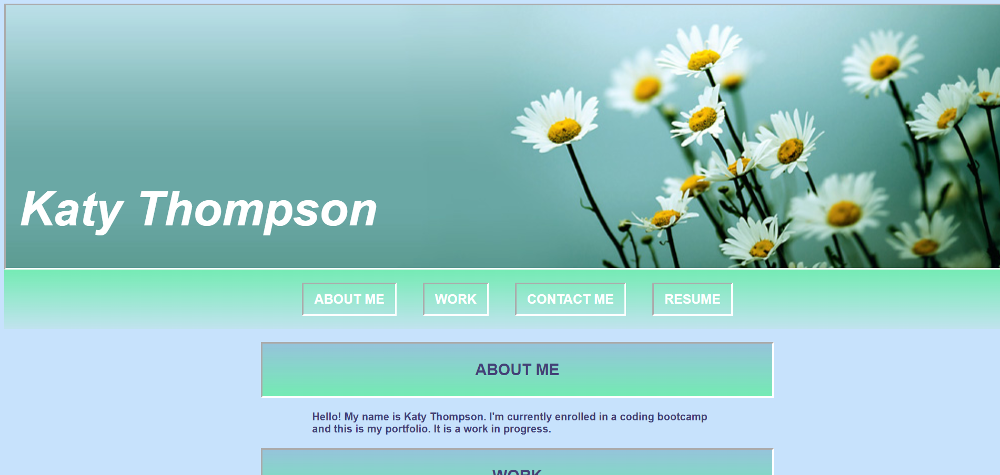

# my-portfolio

## Description

This project was completed so I would have an online portfolio for my work.

##Installation

N/A

##Usage

The webpage can be used to view my work and porfolio. 

##Credits

image1 = https://headerart.weebly.com/flowers-headers.html
image2 = https://wallpapertag.com/baby-seal-wallpaper
image3 = https://cutewallpaper.org/21/navy-seal-screensaver/view-page-21.html
image4 = https://alamy-ltd.ewrvdi.net/c/77643/748811/10905?u=https%3A%2F%2Fwww.alamy.com%2Fstock-photo-sea-lions-sun-on-a-rock-at-trinidad-bay-in-the-california-coastal-84202204.html
image5 = https://wallpapercave.com/w/uwp1837483

## License

MIT License

## Deployment

Link to deployed website: https://katycaroline.github.io/my-portfolio/